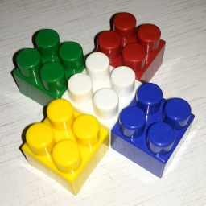
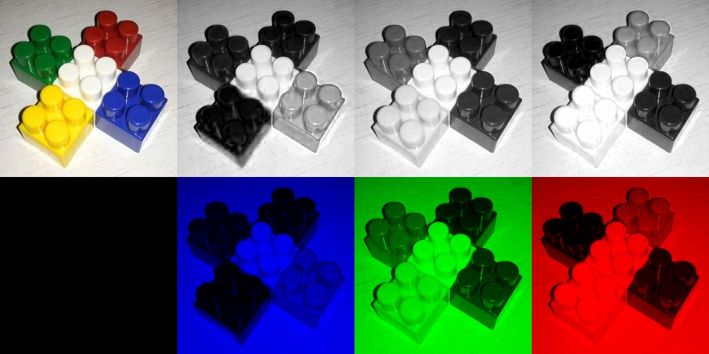
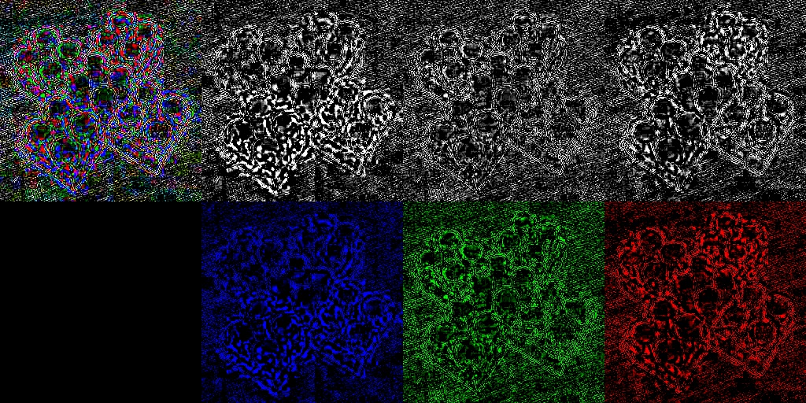
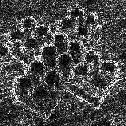

## Работа 2. Визуализация искажений jpeg-сжатия
автор: Малынковский О.В.
дата: @time_stemp@

<!-- url: https://gitlab.com/malynkovsky/image_proc/-/tree/master/lab02 -->

### Задание
Для исходного изображения (сохраненного без потерь) создать jpeg версии с двумя уровнями качества (например, 95 и 65). Вычислить и визуализировать на одной “мозаике” исходное изображение, результаты сжатия, поканальные и яркостные различия.

### Результаты


Рис 1. Исходное изображение








Рис 2. Результаты работы программы 

### Текст программы

```cpp
#include <vector>
#include <stdio.h>
#include <opencv2/opencv.hpp>

using namespace cv;
using namespace std;

Mat Split_into_channels(Mat img) {
	Mat result_img = Mat::zeros(img.cols * 2, img.rows * 4, CV_8UC3); //для мозаики и картинок
	Mat splitted_rgb[3];
	split(img, splitted_rgb);
	Rect roi_0_0 = Rect(0, 0, img.rows, img.cols);
	Rect roi_0_1 = Rect(img.rows, 0, img.rows, img.cols);
	Rect roi_0_2 = Rect(img.rows * 2, 0, img.rows, img.cols);
	Rect roi_0_3 = Rect(img.rows * 3, 0, img.rows, img.cols);
	Rect roi_1_1 = Rect(img.rows, img.cols, img.rows, img.cols);
	Rect roi_1_2 = Rect(img.rows * 2, img.cols, img.rows, img.cols);
	Rect roi_1_3 = Rect(img.rows * 3, img.cols, img.rows, img.cols);
	img.copyTo(result_img(roi_0_0));

	Mat bchannel; Mat gchannel; Mat rchannel;
	Mat bchannel3[] = { splitted_rgb[0] ,splitted_rgb[0],splitted_rgb[0] }; //значения везде такие же , как в синем канале 
	merge(bchannel3, 3, bchannel);
	bchannel.copyTo(result_img(roi_0_1));
	Mat gchannel3[] = { splitted_rgb[1] ,splitted_rgb[1],splitted_rgb[1] };//значения везде такие же , как в зеленом канале 
	merge(gchannel3, 3, gchannel);
	gchannel.copyTo(result_img(roi_0_2));	
	Mat rchannel3[] = { splitted_rgb[2], splitted_rgb[2], splitted_rgb[2] };//значения везде такие же , как в красном канале 
	merge(rchannel3, 3, rchannel);
	rchannel.copyTo(result_img(roi_0_3));

	Mat blue_cl; //значения везде 0 кргоме синего канала 
	Mat b3[] = { splitted_rgb[0], Mat::zeros(img.cols,img.rows, CV_8UC1),Mat::zeros(img.cols,img.rows, CV_8UC1) };
	merge(b3, 3, blue_cl);
	blue_cl.copyTo(result_img(roi_1_1));

	Mat green_cl; //значения везде 0 кргоме зеленого канала 
	Mat g3[] = { Mat::zeros(img.cols,img.rows, CV_8UC1), splitted_rgb[1], Mat::zeros(img.cols,img.rows, CV_8UC1) };
	merge(g3, 3, green_cl);
	green_cl.copyTo(result_img(roi_1_2));

	Mat red_cl; //значения везде 0 кргоме красного канала 
	Mat r3[] = { Mat::zeros(img.cols,img.rows, CV_8UC1),Mat::zeros(img.cols,img.rows, CV_8UC1),splitted_rgb[2] };
	merge(r3, 3, red_cl);
	red_cl.copyTo(result_img(roi_1_3));

	return result_img;
}

int main() {
	Mat img = imread("image.png");
	imwrite("cube_65.jpg", img, { (int)IMWRITE_JPEG_QUALITY, 65 });
	imwrite("cube_95.jpg", img, { (int)IMWRITE_JPEG_QUALITY, 95 });
	Mat img65 = imread("cube_65.jpg");
	Mat img95 = imread("cube_95.jpg");
	Mat full_65 = Split_into_channels(img65);
	Mat full_95 = Split_into_channels(img95);
	imwrite("result95.jpg", full_95);
	imwrite("result65.jpg", full_65);
	imwrite("resultboth.jpg", (full_95 - full_65) * 35);
	Mat img65_gray = imread("cube_65.jpg", IMREAD_GRAYSCALE);
	Mat img95_gray = imread("cube_95.jpg", IMREAD_GRAYSCALE);
	imwrite("resultgray.jpg", cv::abs(img65_gray - img95_gray) * 25);
	waitKey(0);
	return 0;
}


```