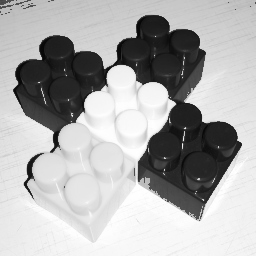

## Работа 3. Обработка изображения в градациях серого
автор: Малынковский О.В.
дата: @time_stemp@

<!-- url: https://gitlab.com/malynkovsky/image_proc/-/tree/master/lab03 -->

### Задание
1. Подобрать и зачитать небольшое изображение $S$ в градациях серого.
2. Построить и нарисовать гистограмму $H_s$ распределения яркости пикселей исходного изображения.
3. Сгенерировать табличную функцию преобразования яркости. Построить график $V$ табличной функции преобразования яркости.
4. Применить табличную функцию преобразования яркости к исходному изображению и получить $L$, нарисовать гистограмму $H_L$ преобразованного изображения.
5. Применить CLAHE с тремя разными наборами параметров (визуализировать обработанные изображения $C_i$ и их гистограммы $H_{C_{i}}$).
6. Реализовать глобальный метод бинаризации (подобрать порог по гистограмме, применить пороговую бинаризацию). Визуализировать на одном изображении исходное $S$ и бинаризованное $B_G$ изображения.
7. Реализовать метод локальной бинаризации. Визуализировать на одном изображении исходное $S$ и бинаризованное $B_L$ изображения.
8. Улучшить одну из бинаризаций путем применения морфологических фильтров. Визуализировать на одном изображении бинарное изображение до и после фильтрации $M$.
9. Сделать визуализацию $K$ бинарной маски после морфологических фильтров поверх исходного изображения (могут помочь подсветка цветом и альфа-блендинг).


### Результаты


Рис. 1. Исходное полутоновое изображение $S$


Рис. 2. Гистограмма $H_s$ исходного полутонового изображения $S$


Рис. 3. Визуализация функции преобразования $V$


Рис. 4.1. Таблично пребразованное изображение $L$


Рис. 4.2. Гистограмма $H_L$ таблично-пребразованного изображения $L$


Рис. 5.1. Преобразование $C_1$ CLAHE с параметрами 40 8x8


Рис. 5.2. Гистограмма $H_{C_{1}}$


Рис. 5.3. Преобразование $C_2$ CLAHE с параметрами 4 4x4


Рис. 5.4. Гистограмма $H_{C_{2}}$


Рис. 5.5. Преобразование $C_3$ CLAHE с параметрами 40 32x32


Рис. 5.6. Гистограмма $H_{C_{3}}$


Рис. 6. Изображение $S$ до и $B_G$ после глобальной бинаризации


Рис. 7. Изображение $S$ до и $B_L$ после локальной бинаризации


Рис. 8. До и после морфологической фильтрации $M$


Рис. 9. Визуализация маски $K$

### Текст программы

```cpp
#include <vector>
#include <stdio.h>
#include <opencv2/opencv.hpp>

using namespace cv;
using namespace std;

void show_histogram(Mat image_grayscale, int hist_size, string filename) {
	array<int, 256> hist{ 0 };
	for (int j_row = 0; j_row < image_grayscale.rows; j_row++)
		for (int i_col = 0; i_col < image_grayscale.cols; i_col++)
			hist[image_grayscale.at<uint8_t>(j_row, i_col)] += 1;
	int max = 0;
	for (int i = 0; i < 256; i++)
		if (max < hist[i])
			max = hist[i];

	float y_scale = (1.0 * hist_size / max); 
	Mat histogram(hist_size, 256, CV_8UC1, Scalar(255, 0, 0));
	for (int x = 0; x < 256; x++)
		line(histogram, Point(x, 0), Point(x, hist_size - y_scale * hist[x]), Scalar(10, 255, 255), 1); 
	imwrite(filename, histogram);
}

int change_brightness(int x) {
	if (x <= 50)
		return(5 * x);
	if ((x > 50) && (x <= 90))
		return(-5 * (x - 50) + 250);
	if ((x > 90) && (x < 180))
		return(50);
	if (x >= 180)
		return(x - 130);
}

int main()
{
	Mat read_image = imread("image.png");
	Mat gray_image;
	cvtColor(read_image, gray_image, COLOR_BGR2GRAY);
	imwrite("lab03.src.png", gray_image);
	show_histogram(gray_image, 150, "lab03.hist.src.png");

	//Отрисовка функции яркостного преобразования
	Mat brightness(256, 256, CV_8UC1, Scalar(255, 0, 0));
	for (int x = 1; x < brightness.cols; x++)
		line(brightness, Point(x - 1, 255 - change_brightness(x - 1)), Point(x, 255 - change_brightness(x)), (1));
	imwrite("lab03.lut.png", brightness);

	//Применение функции яркостного преобразования
	Mat img_bright;
	gray_image.copyTo(img_bright);
	for (int j_row = 0; j_row < gray_image.rows; j_row++)
		for (int i_col = 0; i_col < gray_image.cols; i_col++)
			img_bright.at<uint8_t>(j_row, i_col) = change_brightness(img_bright.at<uint8_t>(j_row, i_col));
	imwrite("lab03.lut.src.png", img_bright);
	show_histogram(img_bright, 150, "lab03.hist.lut.src.png");

	//CLAHE
	Mat pic_clahe1, pic_clahe2, pic_clahe3;
	auto clahe1 = createCLAHE(30, Size(2, 2));
	clahe1->apply(gray_image, pic_clahe1);
	auto clahe2 = createCLAHE(30, Size(8, 8));
	clahe2->apply(gray_image, pic_clahe2);
	auto clahe3 = createCLAHE(30, Size(16, 16));
	clahe3->apply(gray_image, pic_clahe3);

	imwrite( "lab03.clahe.1.png", pic_clahe1);
	imwrite( "lab03.clahe.2.png", pic_clahe2);
	imwrite( "lab03.clahe.3.png", pic_clahe3);
	show_histogram(pic_clahe1, 150, "lab03.hist.clahe.1.png");
	show_histogram(pic_clahe2, 150, "lab03.hist.clahe.2.png");
	show_histogram(pic_clahe3, 150, "lab03.hist.clahe.3.png");

	//Глобальная бинаризация
	Mat global_bin;
	cv::threshold(gray_image, global_bin, 0, 255, THRESH_BINARY | THRESH_OTSU);
	Mat full_bin;
	full_bin.push_back(gray_image);
	full_bin.push_back(global_bin);
	imwrite( "lab03.bin.global.png", full_bin);

	//Локальная бинаризация
	Mat local_bin;
	cv::adaptiveThreshold(gray_image, local_bin, 255, ADAPTIVE_THRESH_MEAN_C, THRESH_BINARY, 3, 2);
	Mat full_local;
	full_local.push_back(gray_image);
	full_local.push_back(local_bin);
	imwrite( "lab03.bin.local.png", full_local);

	//Применение морфологических фильтров
	Mat morph_img;
	Mat res_morph;
	Mat element = cv::getStructuringElement(MORPH_RECT, Size(4, 8));
	cv::morphologyEx(global_bin, morph_img, MORPH_OPEN, element);
	res_morph.push_back(global_bin);
	res_morph.push_back(morph_img);
	imwrite( "lab03.morph.png", res_morph);

	//Визуализация бинарной маски
	Mat binary_mask;
	double alpha = 0.4; double beta = (1.0 - alpha);
	addWeighted(global_bin, alpha, gray_image, beta, 0.0, binary_mask);
	imwrite( "lab03.mask.png", binary_mask);

	waitKey(0);
	return 0;
}

```