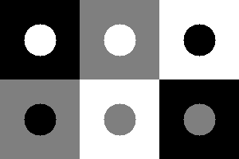
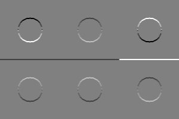
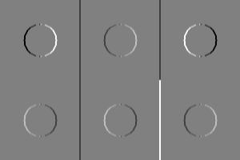
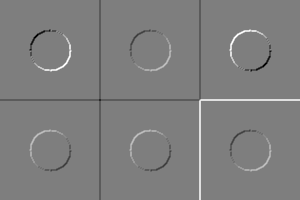

## Работа 4. Использование частных производных для выделения границ
автор: Малынковский О.В.

<!-- url: https://gitlab.com/malynkovsky/image_proc/-/tree/master/lab04-->

### Задание
1. Сгенерировать серое тестовое изображение из квадратов и кругов с разными уровнями яркости (0, 127 и 255) так, чтобы присутствовали все сочетания.
2. Применить первый линейный фильтр и сделать визуализацию результата $F_1$.
3. Применить второй линейный фильтр и сделать визуализацию результата $F_2$.
4. Вычислить $R=\sqrt{F_1^2 + F_2^2}$  и сделать визуализацию R.

### Результаты


Рис. 1. Исходное тестовое изображение


Рис. 2. Визуализация результата $F_1$ применения фильтра


Рис. 3. Визуализация результата $F_2$ применения фильтра


Рис. 4. Визуализация модуля градиента $R$

### Текст программы

```cpp
#include <opencv2/opencv.hpp>
using namespace cv;

int main() {

	int height = 100, width = 100;
	Mat result_image(Mat::zeros(height * 2, width * 3, CV_8UC1));

	Mat img(Mat::zeros(height, width, CV_8UC1));
	circle(img, Point(50, 50), 20, 255, -1, 8, 0);
	img.copyTo(result_image(Rect(0, 0, 100, 100)));

	for (int col = 0; col < width; col += 1) {
		for (int row = 0; row < height; row += 1) {
			img.at<uchar>(Point(col, row)) = 127;
		}
	}
	circle(img, Point(50, 50), 20, 0, -1, 8, 0);
	img.copyTo(result_image(Rect(0, 100, 100, 100)));

	circle(img, Point(50, 50), 20, 255, -1, 8, 0);
	img.copyTo(result_image(Rect(100, 0, 100, 100)));
	for (int col = 0; col < width; col += 1) {
		for (int row = 0; row < height; row += 1) {
			img.at<uchar>(Point(col, row)) = 255;
		}
	}
	circle(img, Point(50, 50), 20, 127, -1, 8, 0);
	img.copyTo(result_image(Rect(100, 100, 100, 100)));
	for (int col = 0; col < width; col += 1) {
		for (int row = 0; row < height; row += 1) {
			img.at<uchar>(Point(col, row)) = 255;
		}
	}
	circle(img, Point(50, 50), 20, 0, -1, 8, 0);
	img.copyTo(result_image(Rect(200, 0, 100, 100)));
	for (int col = 0; col < width; col += 1) {
		for (int row = 0; row < height; row += 1) {
			img.at<uchar>(Point(col, row)) = 0;
		}
	}
	circle(img, Point(50, 50), 20, 127, -1, 8, 0);
	img.copyTo(result_image(Rect(200, 100, 100, 100)));

	namedWindow("Result", 1);
	imshow("Result", result_image);
	imwrite("lab04.src.png", result_image);
	//теперь делаем линейные фильтры
	result_image.convertTo(result_image, CV_32FC1);
	Mat I1(Mat::zeros(height * 2, width * 3, CV_32FC1));
	Mat I2(Mat::zeros(height * 2, width * 3, CV_32FC1));
	Mat I3(Mat::zeros(height * 2, width * 3, CV_32FC1));
	Mat src_1 = result_image.clone();
	Mat src_2 = result_image.clone();

	cv::Mat kernelH(3, 3, CV_32F);
	kernelH.at<float>(0, 0) = 1.0f;
	kernelH.at<float>(0, 1) = 2.0f;
	kernelH.at<float>(0, 2) = 1.0f;

	kernelH.at<float>(1, 0) = 0.0f;
	kernelH.at<float>(1, 1) = 0.0f;
	kernelH.at<float>(1, 2) = 0.0f;

	kernelH.at<float>(2, 0) = -1.0f;
	kernelH.at<float>(2, 1) = -2.0f;
	kernelH.at<float>(2, 2) = -1.0f;


	filter2D(result_image, I1, -1, kernelH, Point(-1, -1), 0, BORDER_DEFAULT);
	filter2D(result_image, I2, -1, kernelH.t(), Point(-1, -1), 0, BORDER_DEFAULT);
	normalize(I1, I1, 0, 255, cv::NORM_MINMAX, CV_32FC1);
	normalize(I2, I2, 0, 255, cv::NORM_MINMAX, CV_32FC1);
	pow(I1, 2, src_1);
	pow(I2, 2, src_2);
	normalize(I1, I1, 0, 255, cv::NORM_MINMAX, CV_8U);
	normalize(I2, I2, 0, 255, cv::NORM_MINMAX, CV_8U);

	namedWindow("Filter1", 1);
	imshow("Filter1", I1);
	namedWindow("Filter2", 1);
	imshow("Filter2", I2);
	imwrite("viz_dx.png", I1);
	imwrite("viz_dy.png", I2);
	I3 = src_1 + src_2;
	sqrt(I3, I3);
	normalize(I3, I3, 0, 255, cv::NORM_MINMAX, CV_8U);
	result_image.convertTo(result_image, CV_8UC1);
	namedWindow("Filter3", 1);
	imshow("Filter3", I3);
	imwrite("lab04.viz_gradmod.png", I3);
	waitKey(0);
	return 0;
}
```